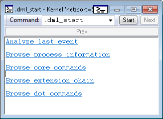
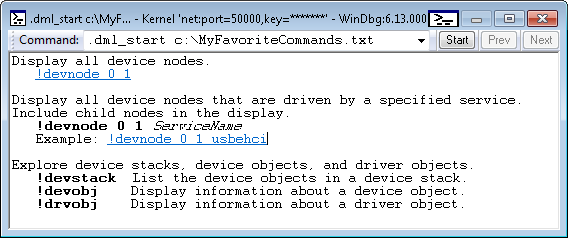

# .dml\_start (Display DML Starting Point)


The **.dml\_start** command displays output that serves as a starting point for exploration using commands that support [Debugger Markup Language](debugger-markup-language-commands.md) (DML).

```
.dml_start
.dml_start filename
```

## <span id="Parameters"></span><span id="parameters"></span><span id="PARAMETERS"></span>Parameters


<span id="filename"></span><span id="FILENAME"></span>*filename*  
The name of a DML file to be displayed as the starting output.

## <span id="Using_the_Default_Starting_Output"></span><span id="using_the_default_starting_output"></span><span id="USING_THE_DEFAULT_STARTING_OUTPUT"></span>Using the Default Starting Output


If *filename* is omitted, the debugger displays a default DML starting output as illustrated in the following image.



Each line of output in the preceding example is a link that you can click to invoke other commands.

## <span id="Providing_a_DML_File"></span><span id="providing_a_dml_file"></span><span id="PROVIDING_A_DML_FILE"></span>Providing a DML File


If you supply a path to a DML file, the file is used as the starting output. For example, suppose the file c:\\MyFavoriteCommands.txt contains the following text and DML tags.

```
Display all device nodes.
   <link cmd="!devnode 0 1">!devnode 0 1</link>

Display all device nodes that are driven by a specified service.
Include child nodes in the display.
   <b>!devnode 0 1</b> <i>ServiceName</i>  
   Example: <link cmd="!devnode 0 1 usbehci">!devnode 0 1 usbehci</link>

Explore device stacks, device objects, and driver objects.
   <b>!devstack</b>  List the device objects in a device stack.
   <b>!devobj</b>    Display information about a device object.
   <b>!drvobj</b>    Display information about a driver object.
```

The command **.dml\_start c:\\MyFavoriteCommands.txt** will display the file as shown in the following image.



Remarks
-------

For information about DML tags that can be used in DML files, see dml.doc in the installation folder for Debugging Tools for Windows.

DML output often works well in the [Command Browser window](command-browser-window.md). To display a DML file in the Command Browser window, use **.browse .dml\_start** *filename*.

## <span id="see_also"></span>See also


[Debugger Markup Language Commands](debugger-markup-language-commands.md)

[**.browse**](-browse--display-command-in-browser-.md)

 

 


