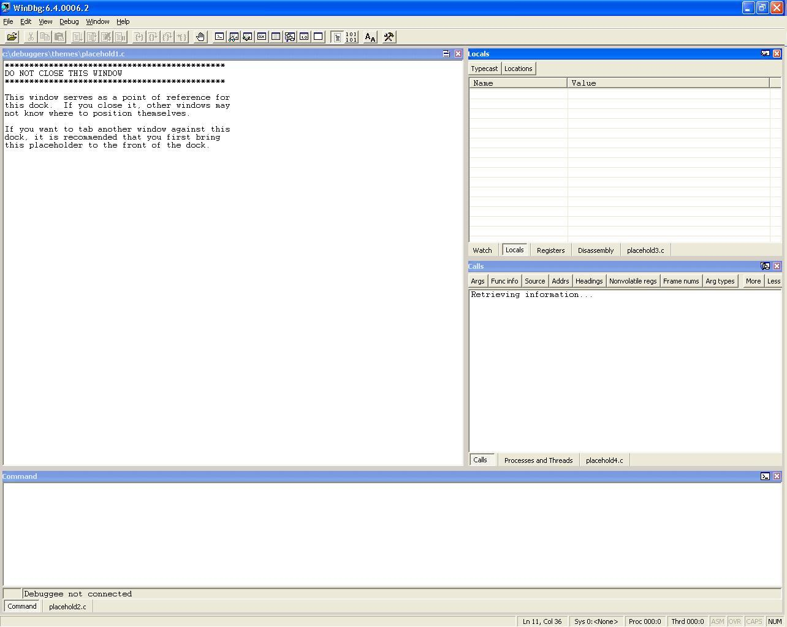
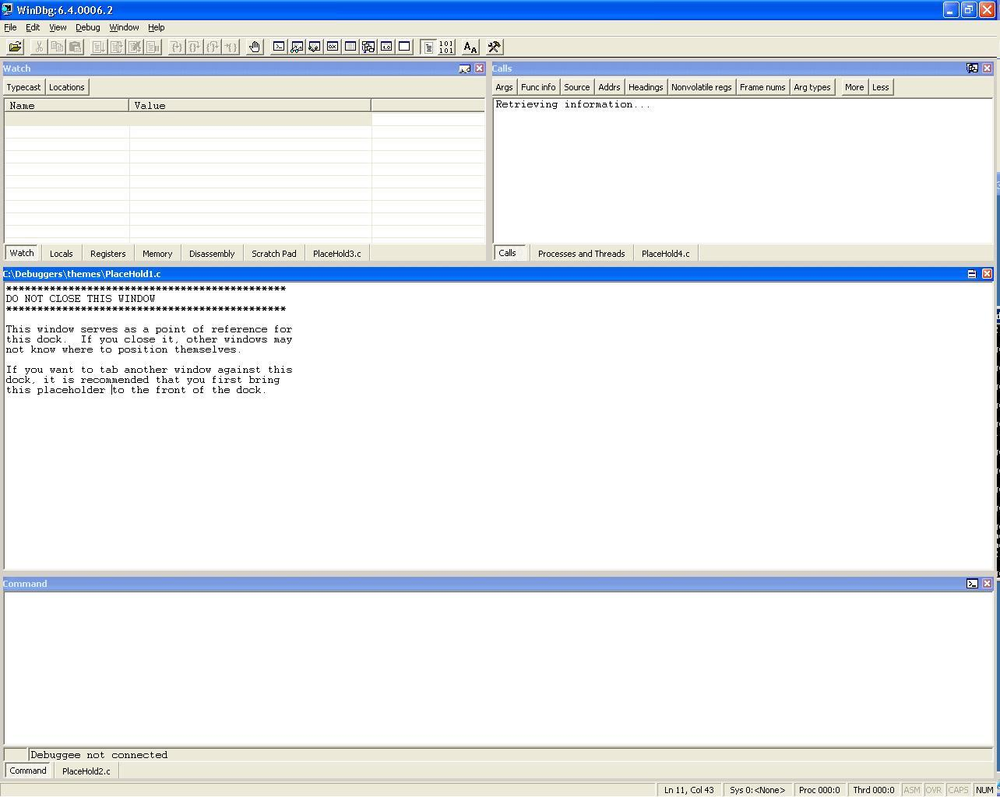
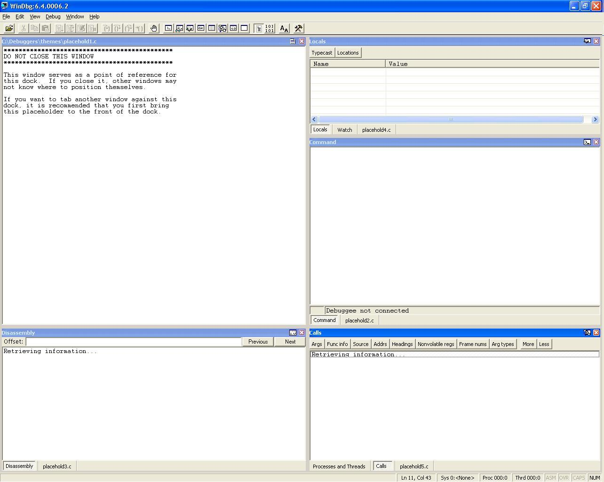
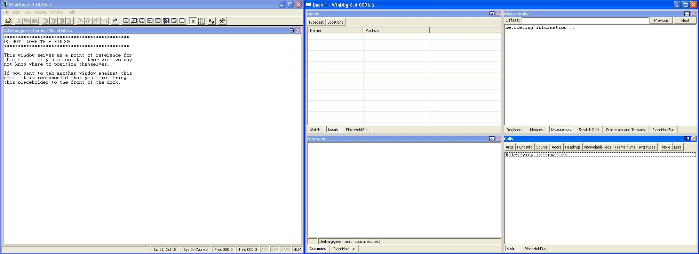

# Using Themes Provided in Debugging Tools for Windows

## 

This topic shows screen shots of the configurations from each of the four themes provided in Debugging Tools for Windows. Those themes are Standard.reg, Standardvs.reg, Srcdisassembly.reg, and Multimon.reg.

### Standard.reg

The Standard.reg theme can be used for most debugging purposes. In this arrangement, the lower third of the WinDbg window is taken by the Debugger Command window. The upper two-thirds is divided roughly in half. The left half is taken up by a placeholder window that indicates where the Source windows open in a tabbed collection. The right half is further divided into halves vertically. The upper half contains a tabbed collection that includes the Watch, Locals, Registers, and Disassembly windows. The lower half contains a tabbed collection that includes the Calls and Processes and Threads windows.

In each docking location, a placeholder window is also included as a point of reference for the other windows. The placeholder windows should not be closed because closing them may change the configuration of the windows. All of the windows in this arrangement are docked.The following screen shot shows the Standard.reg theme.

### Standardvs.reg

The Standardvs.reg theme can be used for most debugging purposes, but is more similar in layout to Visual Studio. In this arrangement, the WinDbg window is divided horizontally into thirds. The upper third is further divided vertically into halves. The left half of the upper third contains a tabbed collection that includes the Watch, Locals, Registers, Memory, Disassembly, and Scratchpad windows. The right half of the upper third contains a tabbed collection that includes the Calls and Processes and Threads windows. The lower third of the WinDbg window is taken by the Debugger Command window. The middle third is filled by a placeholder window that indicates where the Source windows are opened in a tabbed collection.

In each docking location, a placeholder window is also included as a point of reference for the other windows. The placeholder windows should not be closed because closing them may change the configuration of the windows. All of the windows in this arrangement are docked. The following screen shot shows the Standardvs.reg theme.

### Srcdisassembly.reg

The Srcdisassembly.reg theme includes a Disassembly window, for debugging in assembly mode. In this arrangement, the WinDbg window is divided in half vertically, and each half formed is further divided into thirds horizontally. On the right half, the upper third is a tabbed collection of the Locals and Watch windows, the middle third is the Debugger Command window, and the lower third is a tabbed collection of the Processes and Threads and Calls windows. On the left half, the upper two-thirds are taken by a placeholder window that indicates where the Source windows opens in a tabbed collection; the lower third is taken up by the Disassembly window.

In each docking location, a placeholder window is also included as a point of reference for the other windows. The placeholder windows should not be closed because closing them may change the configuration of the windows. All of the windows in this arrangement are docked. The following screen shot shows the Srcdisassembly.reg theme.

### Multimon.reg

The Multimon.reg theme is set up for debugging with multiple monitors. In this arrangement, a new dock is created so that the WinDbg window can be viewed on one monitor and the new dock can be viewed on the other monitor. The WinDbg window is filled by a placeholder window that indicates where the Source windows open in a tabbed collection. The new dock is divided into fourths. The upper left contains a tabbed collection that includes the Watch and Locals windows. The upper right contains a tabbed collection that includes the Registers, Memory, Disassembly, Scratchpad, and Processes and Threads windows. The lower left contains the Debugger Command window. The lower right contains the Calls window.

In each docking location, a placeholder window is also included as a point of reference for the other windows. The placeholder windows should not be closed because closing them may change the configuration of the windows. All of the windows in this arrangement are docked. The following screen shot shows the Multimon.reg theme.

 

 

