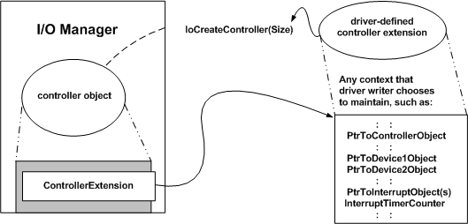

# Creating Controller Objects and Controller Extensions

If a driver uses a controller object, it must call [**IoCreateController**](https://msdn.microsoft.com/library/windows/hardware/ff548395) after it has created device objects and its device is ready for I/O, typically after receiving a PnP [**IRP\_MN\_START\_DEVICE**](https://msdn.microsoft.com/library/windows/hardware/ff551749) request. The following figure illustrates the call.

Every controller object has an associated controller extension. As the previous figure shows, the caller of **IoCreateController** determines the *Size* of the controller extension. Its structure and contents are driver-defined.

In addition to whatever device-specific state information the driver maintains about the physical controller (or device with channels), the previous figure shows a representative set of driver-defined data for a controller extension.

The *PtrToControllerObject* pointer, returned by **IoCreateController**, must be passed in the driver's calls to [**IoAllocateController**](https://msdn.microsoft.com/library/windows/hardware/ff548224) and [**IoFreeController**](https://msdn.microsoft.com/library/windows/hardware/ff549104), described in [Allocating Controller Objects for I/O Operations](allocating-controller-objects-for-i-o-operations.md). The driver must store the returned controller object pointer in the device extensions of its driver-created device objects or in another driver-accessible resident storage area (nonpaged pool, allocated by the driver). If the driver is unloaded, it also must pass the controller object pointer to [**IoDeleteController**](https://msdn.microsoft.com/library/windows/hardware/ff549078).

Most drivers that set up controller objects find it convenient to store a pointer to the current target device object or device extension in the controller extension. Usually, such a driver stores the controller object pointer in every one of its device extensions so that it can use the *ControllerObject***-&gt;ControllerExtension** pointer to access driver-maintained, controller-specific state about I/O operations for every target device object.

If the physical controller represented by a controller object generates interrupts, a driver also can use the controller extension as storage for *PtrToInterruptObject* pointers returned by [**IoConnectInterrupt**](https://msdn.microsoft.com/library/windows/hardware/ff548371). For more information, see [Interrupt Service Routines](interrupt-service-routines.md).

**IoCreateController** allocates resident storage for the controller object and extension, which it initializes with zeros. If it cannot allocate the memory, **IoCreateController** returns a **NULL** pointer. If this occurs, the driver must fail device startup and should return STATUS\_INSUFFICIENT\_RESOURCES.

 

 

